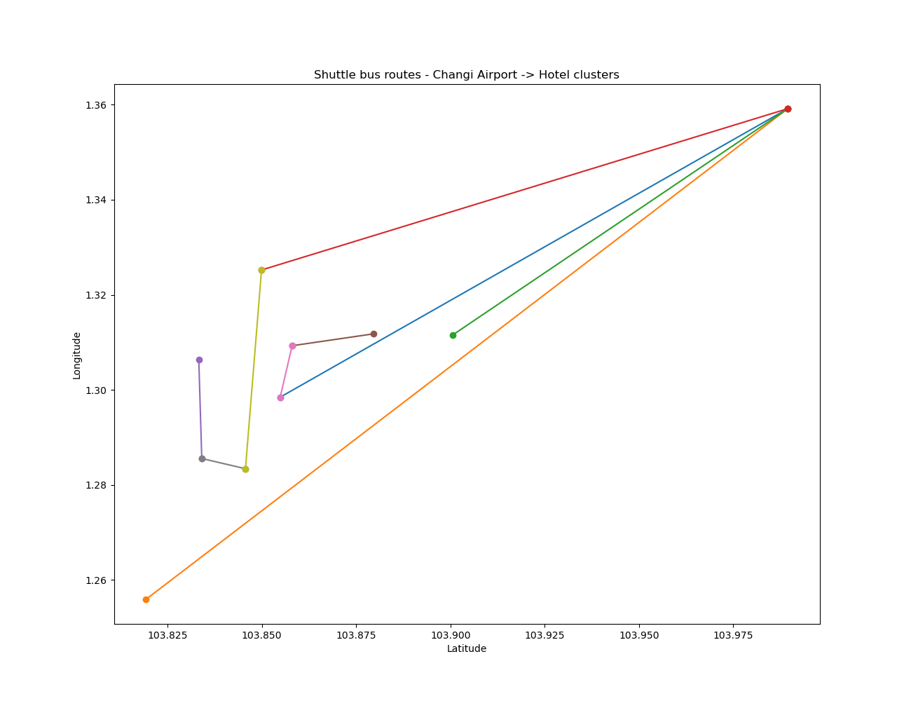

# Capacitated-Vehicle-Routing-Singapore-Hotels
Capacitated vehicle routing optimization for shuttle bus service serving hotels in Singapore.  
- Number of routes optimization for real time/distances using googlemaps distance matrix API.
- Demand estimated from hotel occupancy rate, flight arrival, loading factor to account for expected demand of service and time window of the day.
- Hotel demand modeled for 1h time windows (24 total hours)  

HTML render to visualize dynamic maps: 
https://nbviewer.org/github/FelipeChapa/Capacitated-Vehicle-Routing-Singapore-Hotels/blob/main/Capacitated%20Vehicle%20Routing.ipynb  

## Singapore hotel clustering

## Optimized shuttle bus routing based on demand at time window

##Collaborators

Felipe Chapa Chamorro
Gino Martelli S Tiu
Hai-Hsin Huang
Susan Koruthu
Tsao, Kai-Ting
